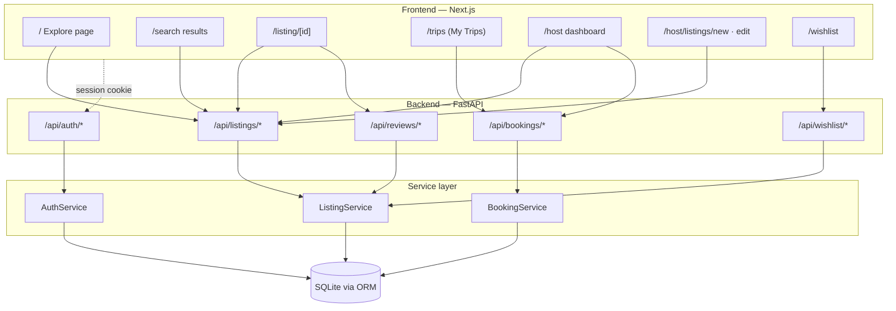
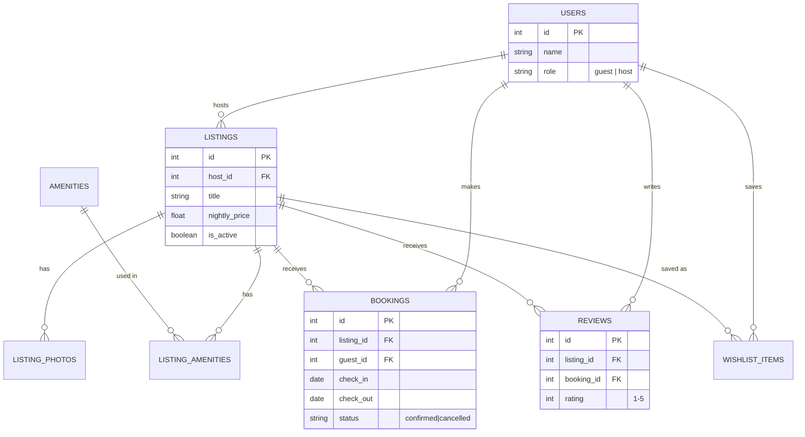

# 🏡 Airbnb Clone

A full-stack, production-ready Airbnb clone designed with a focus on modern UI/UX, robust backend architecture, and seamless performance. 

This repository contains both the **Next.js Frontend** and the **FastAPI Backend**, consolidated for easy review and archival.

---

## 🚀 Live Demo
- **Frontend (Vercel):** [https://airbnb-demo-beta-three.vercel.app](https://airbnb-demo-beta-three.vercel.app)
- **Backend API Docs (Azure VM):** [https://20-2-88-158.sslip.io/docs](https://20-2-88-158.sslip.io/docs)

> 💡 **Role Switching**: The demo features a role-switching mechanic (Guest ↔ Host) for easy evaluation. No password or email verification is required.

---

## 🛠️ Tech Stack

| Layer | Technologies |
| :--- | :--- |
| **Frontend** | Next.js 14 (App Router), TypeScript, Tailwind CSS |
| **Backend** | FastAPI, Python 3.11+, Pydantic, SQLAlchemy ORM |
| **Database** | SQLite (designed for easy porting to PostgreSQL) |
| **Deployment** | Vercel (Frontend), Azure VM (Backend) |

---

## 📐 System Architecture

Our application follows a standard, decoupled 3-tier architecture. 
The Next.js frontend acts as the client (and proxy for CORS bypass on Vercel), the FastAPI backend provides a RESTful API with a thin service layer, and SQLAlchemy handles data persistence.



---

## 🗄️ Database Schema (ERD)

The database schema is heavily relational. Notably:
- **Amenities** use a many-to-many join table (`LISTING_AMENITIES`) for strict vocabulary control.
- **Availability** is derived entirely from `BOOKINGS` (where `status = 'confirmed'`) to prevent sync bugs.



---

## 🔌 API Overview

All backend endpoints enforce a consistent JSON envelope: `{ data, error }`. 

| Method | Path | Purpose | Auth Required |
| :--- | :--- | :--- | :--- |
| **GET** | `/api/listings` | Search and filter listings (with pagination) | ❌ |
| **GET** | `/api/listings/{id}` | Full listing detail & availability check | ❌ |
| **POST** | `/api/bookings` | Create a booking (validates overlap) | ✅ (Guest) |
| **GET** | `/api/bookings/mine`| Retrieve user's past/upcoming trips | ✅ (Guest) |
| **POST** | `/api/listings` | Create a new listing | ✅ (Host) |
| **GET** | `/api/host/listings`| View owned listings & booking counts | ✅ (Host) |

---

## 💡 Assumptions & Scope Notes

- **Auth**: Fully mocked. Authentication acts as a session toggle between `guest` and `host` roles without real passwords.
- **Payments**: The checkout flow simulates a 1-2 second processing delay, but no actual payment gateway is integrated.
- **Availability**: Checked in real-time server-side (`new.check_in < existing.check_out AND new.check_out > existing.check_in`) to ensure zero double-booking race conditions.
- **Maps & Messaging**: Replaced with clean, tasteful "Coming Soon" UI components to adhere to the MVP scope while maintaining design fidelity.

---

## 💻 Local Setup Instructions

### 1. Backend (FastAPI)
```bash
cd backend
python -m venv venv
source venv/bin/activate  # Or `venv\Scripts\activate` on Windows
pip install -r requirements.txt
python -m app.seed.seed   # Generate SQLite DB & Seed Data
uvicorn app.main:app --reload
```
The backend will run on `http://localhost:8000`.

### 2. Frontend (Next.js)
```bash
cd frontend
npm install
npm run dev
```
Create a `.env.local` inside `frontend/` with:
```env
NEXT_PUBLIC_API_BASE_URL=http://localhost:8000
```
The frontend will run on `http://localhost:3000`.

---

## ✨ Features Implemented
- **Home/Explore**: Dynamic listing grid with location, date, and guest search filters.
- **Listing Details**: Asymmetric photo galleries, full amenity lists, and real-time blocked date calendars.
- **Booking Flow**: Safe overlap validation, checkout UI, and dedicated "My Trips" dashboard.
- **Host Dashboard**: Full CRUD capabilities for owned listings. 
- **UX Polish**: Animated modals, toaster notifications, and responsive mobile-first layouts mimicking Airbnb's signature design. 
