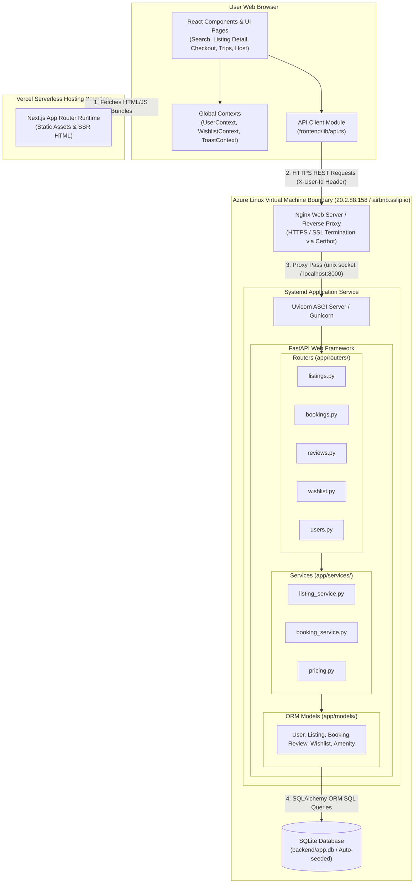
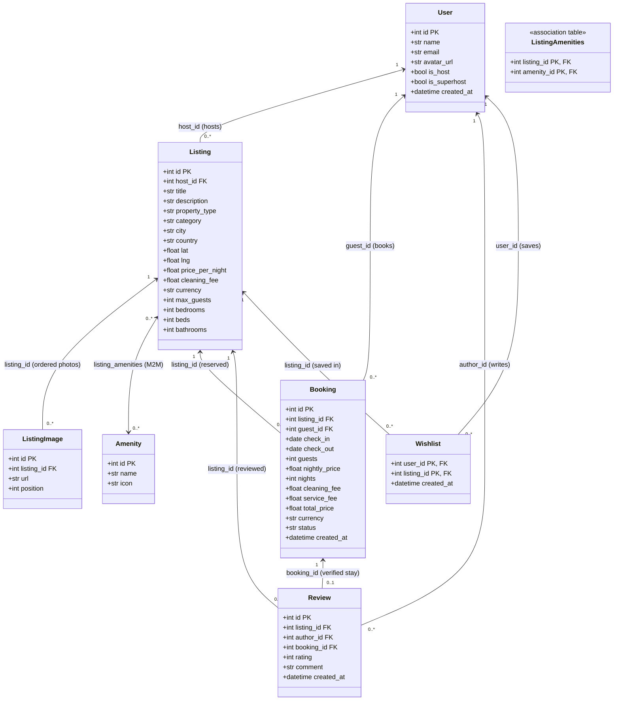
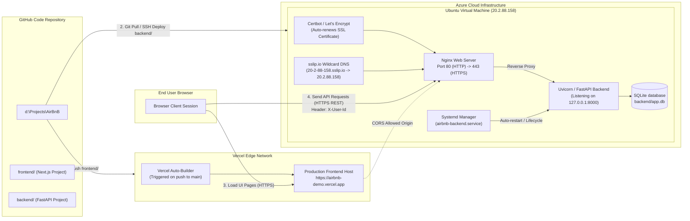

# Airbnb Clone: Complete Technical Project Deep Dive

This document serves as the master interview preparation guide for the full-stack Airbnb clone codebase. It provides an executive project overview, an architecture and project flow narrative, technical system diagrams, complete file-by-file breakdowns of both backend and frontend layers, and a quick-reference Q&A section to defend key engineering decisions during technical interviews.

---

## 1. Project Overview

This application is a production-grade, full-stack Airbnb clone developed as a showcase project demonstrating modern web application architecture, state management, relational schema modeling, and cloud deployment practices. The project is designed around a decoupled, two-track architecture: a **Next.js (App Router, TypeScript, Tailwind CSS v4)** frontend deployed serverless on **Vercel**, and a **Python FastAPI** backend hosted on an **Azure Linux Virtual Machine** behind an **Nginx** reverse proxy with Let's Encrypt SSL (`sslip.io`). Communication between the two tiers occurs via typed **HTTPS REST APIs**, using a header-based authentication strategy (`X-User-Id`) to enable instant persona switching between Guest and Host roles while strictly enforcing server-side authorization and date overlap constraints.

---

## 2. Architecture & Project Flow Narrative

### High-Level System Architecture
The application is a decoupled, two-tier architecture:
- **Frontend**: Next.js (App Router, TypeScript, Tailwind CSS v4) deployed serverless on **Vercel**.
- **Backend**: Python FastAPI application deployed on an **Azure Linux Virtual Machine**, running behind an **Nginx** reverse proxy and managed by **Systemd**.
- **Communication Layer**: The frontend and backend communicate exclusively over **HTTPS REST APIs**. User identity and request scoping are passed via a custom `X-User-Id` HTTP request header, which the backend inspects on protected routes to simulate authenticated tenant contexts without requiring full auth handshake overhead.

```
┌────────────────────────────────────────┐       HTTPS REST       ┌────────────────────────────────────────┐
│           Next.js Frontend             │ ────────────────────►  │           Nginx Reverse Proxy          │
│          (Deployed on Vercel)          │   X-User-Id: <id>      │         (Azure Linux VM + SSL)         │
└────────────────────────────────────────┘                        └───────────────────┬────────────────────┘
                                                                                      │ unix socket / proxy
                                                                                      ▼
                                                                  ┌────────────────────────────────────────┐
                                                                  │             FastAPI Backend            │
                                                                  │         (Uvicorn + Systemd)            │
                                                                  └───────────────────┬────────────────────┘
                                                                                      │ SQLAlchemy ORM
                                                                                      ▼
                                                                  ┌────────────────────────────────────────┐
                                                                  │            SQLite Database             │
                                                                  │          (app.db / Auto-seeded)        │
                                                                  └───────────────────┬────────────────────┘
```

### Architectural Rationale: Why These Choices?

1. **SQLite over Managed Cloud DB**:
   - **Reasoning**: SQLite provides a zero-configuration, single-file relational database embedded directly alongside the FastAPI service. For an interview demo project, it completely eliminates cloud database infrastructure overhead, connection pooling configuration, and monthly hosting costs.
   - **Stateless Demo Feel**: Coupled with an automatic startup seeding script (`app/seed/seed.py`), if the database file is ever missing or empty, FastAPI auto-populates realistic listings, users, and reviews on boot.

2. **FastAPI for the Backend**:
   - **Reasoning**: FastAPI offers native async I/O performance, automatic Pydantic request/response schema validation, and instant OpenAPI/Swagger interactive documentation generation (`/docs`). This allowed rapid, self-documenting API development.

3. **Routers → Services → Models Layering**:
   - **Reasoning**: Enforces strict separation of concerns:
     - **Routers (`app/routers/`)**: Handle HTTP request parsing, header extraction (`X-User-Id`), status code responses, and schema serialization.
     - **Services (`app/services/`)**: Contain pure business logic (date math, pricing calculations, overlap validation, host authorization checks).
     - **Models (`app/models/`)**: Define SQLAlchemy ORM database table schemas and relationships.
   - **Benefit**: Pricing math and date overlap rules can be unit-tested in isolation without mocking HTTP requests or database sessions.

4. **Mock Header Authentication (`X-User-Id`)**:
   - **Reasoning**: Traditional auth (OAuth2/JWT/Cognito) introduces sign-up forms and login friction for interviewers reviewing the project. Mocking auth via an explicit `X-User-Id` request header provides immediate persona switching (e.g. instantly acting as a Guest or Host via a dropdown UI) while preserving full server-side authorization enforcement (`403 Forbidden` on unauthorized resource access).

---

### Build Order Narrative

When walking an interviewer through the construction of this project, present the build process as a disciplined, risk-first sequence:

#### 1. Backend Scaffolding & Core Schema Design
The project began by modeling the core domain entities (`User`, `Listing`, `Booking`, `Review`) in SQLAlchemy.
- **Key Schema Decision**: Financial price snapshotting on bookings. Instead of dynamically computing reservation totals based on current listing prices, the `Booking` model explicitly snapshots `nightly_price`, `cleaning_fee`, `service_fee`, and `total_price` at the exact moment of reservation.
- **Why**: Historical receipts must remain immutable. If a host updates their nightly rate from $100 to $200 next month, past bookings must retain their original quoted price.

#### 2. Read Endpoints Before Write Logic
Development prioritized read-only endpoints (`GET /api/listings`, `GET /api/listings/{id}`, `GET /api/reviews`) before touchy state mutations.
- **Why**: Building feed retrieval and detail pages first allowed establishing the exact data structures required by the UI, verifying pagination and search filtering, and seeding realistic data before adding transactional risk.

#### 3. Server-Side Booking Overlap Enforcement
With read models established, reservation creation logic was implemented inside `app/services/booking_service.py`. The core challenge was preventing double-bookings.
- **Overlap Logic**: A new reservation `(new_start, new_end)` overlaps with an existing confirmed booking `(exist_start, exist_end)` if and only if:
  $$\text{new\_check\_in} < \text{existing\_check\_out} \quad \text{AND} \quad \text{new\_check\_out} > \text{existing\_check\_in}$$
- **SQL Implementation**:
  ```sql
  SELECT * FROM bookings
  WHERE listing_id = :listing_id
    AND status = 'confirmed'
    AND :check_in < check_out
    AND :check_out > check_in
  ```
- **Why Server-Side**: Client-side date validation can easily be bypassed or suffer from stale state when two users view the same listing simultaneously. Enforcing this check inside an atomic database query guarantees that concurrent attempts result in a deterministic `HTTP 409 Conflict`.

#### 4. Host Management & Authorization Rules
Host CRUD endpoints (`POST/PUT/DELETE /api/listings`) were added next in `app/routers/listings.py`.
- **Ownership Verification**: Every update or delete request checks `X-User-Id`. If `user.id != listing.host_id`, the API immediately aborts with `HTTP 403 Forbidden`.

#### 5. Idempotent & Deterministic Database Seeding
To ensure consistent demo behavior, `app/seed/seed.py` was built with `random.seed(42)` and deterministic fixture datasets.
- **Why**: VM restarts, environment redeployments, or disk resets shouldn't result in a blank application. On startup, FastAPI checks table counts; if empty, it populates properties across global and Indian destinations, active host accounts, and review histories automatically.

#### 6. Independent Backend Deployment & Verification
Before writing frontend code, the backend was deployed to an Azure Linux VM with Nginx and Uvicorn.
- **Verification**: All API endpoints were thoroughly tested via FastAPI's interactive `/docs` Swagger UI and automated Pytest scripts. This ensured the API contract was solid before frontend integration began.

#### 7. Frontend Integration Sequence
The Next.js App Router frontend was built systematically:
1. **Scaffold & Design System**: Configured Tailwind CSS v4 and defined global CSS variables (`app/globals.css`).
2. **API Client Layer**: Built `frontend/lib/api.ts` as a unified fetch wrapper to automatically inject `X-User-Id` headers and unwrap backend error responses.
3. **App Shell**: Created `RootLayout` (`app/layout.tsx`) with persistent header navigation (`NavBar`), footer (`Footer`), and global React contexts (`UserContext`, `WishlistContext`, `ToastContext`).
4. **Search & Discovery**: Implemented `app/search/page.tsx` with URL parameter binding for location, guest counts, price sliders, and category filters.
5. **Listing Detail Page**: Built `app/listing/[id]/page.tsx` with photo galleries, amenity grids, host details, and the interactive `BookingWidget`.
6. **Checkout & Reservation Flow**: Implemented `app/checkout/page.tsx` to request real-time price quotes (`POST /api/bookings/quote`) and post booking creations (`POST /api/bookings`), handling `409 Conflict` errors by displaying toast notifications.
7. **Trips & Wishlists**: Added `app/trips/page.tsx` for guests to review/cancel upcoming stays and `app/wishlist/page.tsx` to view saved properties.
8. **Host Dashboard**: Built `app/host/page.tsx` allowing host users to manage listings, view earnings, and trigger modal editors.

#### 8. Later Incremental Enhancements
- **HTTPS & SSL Setup**: When the frontend was deployed to Vercel (HTTPS), browsers blocked requests to the backend HTTP IP address due to mixed-content security policies. Fixed by configuring Let's Encrypt SSL via Certbot and `sslip.io` wildcard DNS on the Azure VM.
- **Multi-Currency Support**: Added real-time currency conversion (USD, EUR, GBP, INR) across property listings.
- **Indian-Region Listings**: Expanded seed data with curated properties in Goa, Jaipur, Bengaluru, and Mumbai.
- **Token-Based Dark Mode**: Implemented complete theme toggling using CSS custom properties with zero FOUC (flash of unstyled content) via an inline head script.
- **Post-Stay Review System**: Built star-rating modals on completed trips, syncing back to the backend.

---

## 3. System Diagrams

### 3.1 System Component Diagram



**Explanation**: Shows the end-to-end multi-tier interaction flow from the user browser through Next.js on Vercel into the Azure VM, down to SQLite. The API client in `frontend/lib/api.ts` acts as the single gateway for all HTTP communications. The backend enforces a 3-layer architecture (Routers $\rightarrow$ Services $\rightarrow$ Models) inside an isolated Systemd/Uvicorn process managed behind Nginx.

---

### 3.2 Class Diagram (Backend SQLAlchemy Domain Models)



**Explanation**: Displays the relational schema design implemented in SQLAlchemy (`backend/app/models/`). `User` represents both guests and hosts using an `is_host` role flag. Financial totals are snapshotted on `Booking`. `Wishlist` uses a composite primary key `(user_id, listing_id)`, and `Review.booking_id` carries a `UNIQUE` constraint preventing duplicate feedback.

---

### 3.3 Deployment Pipeline & Infrastructure Diagram



**Explanation**: Details the dual-cloud pipeline. Frontend code in `frontend/` auto-deploys to Vercel's global CDN. Backend code in `backend/` runs on an Azure Linux VM managed by Systemd. Nginx terminates SSL via Let's Encrypt / `sslip.io` wildcard DNS, resolving mixed-content browser restrictions (`CORS_ORIGINS`) between Vercel and the VM API.

---

## 4. Backend File-by-File Breakdown

### 4.1 Application Entrypoint
- **`backend/app/main.py`**: Assembles the FastAPI application instance, configures lifespan events (`Base.metadata.create_all` and `seed_database`), attaches `CORSMiddleware`, defines global envelope exception handlers (`{ "data": null, "error": ... }`), and mounts all routers (`listings`, `bookings`, `host`, `wishlist`, `reviews`, `users`, `meta`).

### 4.2 Core Infrastructure (`backend/app/core/`)
- **`backend/app/core/config.py`**: Loads application environment settings via Pydantic `BaseSettings` (`DATABASE_URL`, `CORS_ORIGINS`, `SERVICE_FEE_PCT=0.12`).
- **`backend/app/core/database.py`**: Configures the SQLAlchemy engine (`connect_args={"check_same_thread": False}`), enables SQLite PRAGMA `WAL` and `foreign_keys=ON`, defines `SessionLocal`, and exports `Base`.
- **`backend/app/core/deps.py`**: Exports FastAPI dependencies: `get_db()` (yields session, guarantees closure), `get_current_user()` (inspects `X-User-Id` header and queries `users` table), and `require_host()` (verifies `user.is_host` is `True`).

### 4.3 ORM Domain Models (`backend/app/models/`)
- **`backend/app/models/user.py`**: `User` model. Represents both guests and hosts in one table via `is_host` role flag.
- **`backend/app/models/listing.py`**: `Listing`, `ListingImage`, `Amenity` models, and `listing_amenities` association table. Keeps photos ordered via `position` column.
- **`backend/app/models/booking.py`**: `Booking` model. Snapshots prices (`nightly_price`, `cleaning_fee`, `service_fee`, `total_price`), stores `check_out` as exclusive Date, uses `status="cancelled"` for soft cancellations, and indexes `(listing_id, check_in, check_out)`.
- **`backend/app/models/review.py`**: `Review` model. Carries a `UNIQUE` constraint on `booking_id` guaranteeing 1 review per completed stay.
- **`backend/app/models/wishlist.py`**: `Wishlist` model. Uses a composite primary key `(user_id, listing_id)`.

### 4.4 Pydantic Schemas (`backend/app/schemas/`)
- **`backend/app/schemas/common.py`**: Generic `ResponseEnvelope[T]` (`data`, `error`).
- **`backend/app/schemas/user.py`**: `UserOut`, `UserBrief`, `BecomeHostRequest`.
- **`backend/app/schemas/listing.py`**: `ListingCard`, `ListingDetail`, `ListingCreate`, `ListingUpdate`, `ListingSearchResponse`.
- **`backend/app/schemas/booking.py`**: `BookingCreate` (with `check_out > check_in` date validator), `PriceBreakdown`, `BookingOut`, `PriceQuoteRequest`.
- **`backend/app/schemas/review.py`**: `ReviewCreate` (rating 1-5 validation), `ReviewOut`.
- **`backend/app/schemas/wishlist.py`**: `WishlistItemOut`.

### 4.5 Services Layer (`backend/app/services/`)
- **`backend/app/services/pricing.py`**: Pure standalone function `compute_price(price_per_night, cleaning_fee, check_in, check_out)`. Used by both price quote endpoint and booking creation to prevent pricing drift.
- **`backend/app/services/booking_service.py`**: Encapsulates `get_blocked_dates()`, `check_overlap()`, `create_booking()`, `cancel_booking()`, and `get_my_bookings()`.
- **`backend/app/services/listing_service.py`**: Encapsulates `search_listings()`, `get_listing_detail()`, `create_listing()`, `update_listing()`, `delete_listing()`, and host queries.

### 4.6 Routers (`backend/app/routers/`)
- **`backend/app/routers/listings.py`**: Endpoints for listing search, detail, availability, price quote, and host CRUD.
- **`backend/app/routers/bookings.py`**: Endpoints for creating bookings (`POST /api/bookings`), fetching user trips (`GET /api/bookings/mine`), and cancelling stays (`DELETE /api/bookings/{id}`).
- **`backend/app/routers/reviews.py`**: Endpoints for listing reviews and submitting stay feedback.
- **`backend/app/routers/wishlist.py`**: Endpoints for viewing and toggling saved wishlists.
- **`backend/app/routers/host.py`**: Endpoints for host property tables and reservation tracking.
- **`backend/app/routers/users.py`**: Endpoints for profile listing, current user details, and host promotion.
- **`backend/app/routers/meta.py`**: Endpoints for static categories and amenity catalogues.

### 4.7 Seed & Audit Testing (`backend/app/seed/` & `backend/tests/`)
- **`backend/app/seed/seed.py`**: Idempotent seeding script using `random.seed(42)` populating 9 users, 12 amenities, 25 listings across global and Indian regions, past reviews, and bookings.
- **`backend/tests/test_audit.py`**: 9-point Pytest audit suite testing contract schemas, auto-seeding, pricing quotes, ownership checks, cancellation availability recovery, filtering, and constraint enforcement.

---

## 5. Frontend File-by-File Breakdown

### 5.1 App Layout & Root Structure
- **`frontend/app/layout.tsx`**: Root layout wrapping all pages in Inter font, anti-FOUC theme script, and global providers (`UserProvider`, `WishlistProvider`, `ToastProvider`), rendering persistent `NavBar` and `Footer`.
- **`frontend/app/globals.css`**: Defines CSS custom properties (`--bg`, `--surface-raised`, `--text-primary`, `--rausch`) under `:root` and `[data-theme="dark"]`, mapped to Tailwind v4 via `@theme inline`.
- **`frontend/app/page.tsx`**: Redirects `/` to `/search`.

### 5.2 Page Routes (`frontend/app/`)
- **`frontend/app/search/page.tsx`**: Search feed displaying URL-bound search filters, category pills, and `ListingGrid`.
- **`frontend/app/listing/[id]/page.tsx`**: Detail page loading photos, amenity lists, host info, `BookingWidget`, and `ListingReviews`.
- **`frontend/app/checkout/page.tsx`**: Reservation confirmation page fetching backend price quote and executing `api.createBooking()`.
- **`frontend/app/booked/page.tsx`**: Post-checkout reservation receipt confirmation view.
- **`frontend/app/trips/page.tsx`**: Guest trips dashboard showing active/past stays, cancellation controls, and review triggers.
- **`frontend/app/wishlist/page.tsx`**: Saved listings grid powered by `WishlistContext`.
- **`frontend/app/host/page.tsx`**: Host management dashboard displaying earnings, occupancy stats, and listing tables.
- **`frontend/app/host/listings/new/page.tsx` & `[id]/edit/page.tsx`**: Dedicated form pages for listing creation and editing.

### 5.3 UI & Feature Components (`frontend/components/`)
- **Navigation (`components/nav/`)**: `NavBar.tsx` (header bar), `SearchBar.tsx` (expandable search trigger), `CategoryBar.tsx` (category icon pills), `UserSwitcher.tsx` (1-click persona switcher), `Footer.tsx`.
- **Listing (`components/listing/`)**: `ListingCard.tsx` (card with image carousel & wishlist heart), `ListingGrid.tsx` (responsive layout grid), `FilterModal.tsx` (multi-faceted filter overlay), `ListingHeader.tsx`, `PhotoGallery.tsx`, `ListingPhotosModal.tsx` (lightbox), `ListingReviews.tsx`.
- **Booking (`components/booking/`)**: `BookingWidget.tsx` (sticky reservation card on detail pages), `BookingCard.tsx` (trip status card), `PriceBreakdownModal.tsx`.
- **Review & Host (`components/review/` & `components/host/`)**: `ReviewModal.tsx` (star rating & comment dialog), `ReviewStars.tsx`, `HostListingsTable.tsx`, `ListingFormModal.tsx`.
- **UI Controls (`components/ui/`)**: `Button.tsx`, `Modal.tsx`, `Pill.tsx`, `Icons.tsx` (SVG library), `ThemeToggle.tsx` (Light/Dark mode button).

### 5.4 Utilities & State (`frontend/lib/` & `frontend/context/`)
- **`frontend/lib/api.ts`**: Single fetch wrapper. Injects `X-User-Id` header, unwraps API error envelopes, and exposes typed backend methods.
- **`frontend/lib/types.ts`**: TypeScript domain interfaces (`Listing`, `Booking`, `Review`, `User`).
- **`frontend/lib/formatPrice.ts` & `format.ts`**: Multi-currency conversion (USD, EUR, GBP, INR) and date range formatters.
- **`frontend/context/UserContext.tsx`**: Global persona state (`currentUser`, `switchUser`).
- **`frontend/context/WishlistContext.tsx`**: Global saved property state (`wishlistIds`, `toggleWishlist`).
- **`frontend/context/ToastContext.tsx`**: Floating notification manager (`showToast`).

---

## 6. Key Design Decisions Q&A (Interview Quick-Reference)

Use this quick-reference section for last-minute review before a technical interview:

#### Q1: "Why did you choose SQLite over a managed PostgreSQL or MySQL database?"
> **Answer**: "SQLite was chosen deliberately to make the application self-contained, zero-cost, and trivial to evaluate. It runs embedded alongside FastAPI, eliminating cloud database provisioning and connection pooling overhead. Combined with our idempotent startup seeding script (`seed.py`), if the database file is missing or wiped on VM reboot, the app auto-populates realistic data instantly. The trade-off is SQLite's database-level write lock under high concurrency, which we acknowledge — for a production scale-out system with thousands of write requests per second, we would migrate to PostgreSQL using SQLAlchemy's abstract layer without altering business logic."

#### Q2: "How does the system handle user authentication and persona switching?"
> **Answer**: "We implemented a header-based identity model using a custom `X-User-Id` HTTP header. This was designed specifically to minimize reviewer friction: evaluators can toggle between 'Guest' and 'Host' personas in a single click via our frontend `UserSwitcher` component without going through login forms. The backend `get_current_user` dependency inspects this header and strictly enforces server-side authorization (`403 Forbidden` if a non-host attempts host operations). The trade-off is that header-based identity is not secure for open production without an API gateway or JWT verification layer."

#### Q3: "How do you prevent double-bookings when multiple users attempt to book the same property for overlapping dates?"
> **Answer**: "Double-booking prevention is enforced strictly on the server inside `app/services/booking_service.py` within an atomic database transaction. We evaluate the overlap condition using semi-open date interval math: `new_check_in < existing_check_out AND new_check_out > existing_check_in` for all confirmed bookings. Client-side date validation is treated purely as UI enhancement; the true source of truth is the atomic SQL check, which returns an `HTTP 409 Conflict` if dates overlap, prompting the frontend to notify the user gracefully."

#### Q4: "Why are prices snapshotted directly onto the Booking database record?"
> **Answer**: "We snapshot `nightly_price`, `cleaning_fee`, `service_fee`, and `total_price` onto the `Booking` row at the moment of reservation to ensure immutable financial history. If a host increases their nightly rate from $150 to $300 next month, past receipts and confirmed reservations must retain the original rate agreed upon during checkout. The minor trade-off is data duplication in the `bookings` table, which is standard practice in e-commerce and reservation domain modeling."

#### Q5: "Why deploy the backend via Systemd + Nginx on an Azure VM instead of Docker containers?"
> **Answer**: "Direct VM deployment with Systemd and Nginx was selected to minimize memory overhead on a lightweight Azure VM slice while ensuring production reliability. Systemd provides background process lifecycle monitoring and automatic restart on crash, while Nginx acts as a high-performance reverse proxy handling Let's Encrypt SSL termination via `sslip.io` wildcard DNS. This resolved HTTPS mixed-content browser blocking when communicating with the Vercel-hosted frontend."

#### Q6: "How does the dark mode implementation work across the application?"
> **Answer**: "Dark mode is built on a tokenized design system defined in `frontend/app/globals.css`. We defined 15 semantic CSS custom properties (`--bg`, `--surface-raised`, `--text-primary`, `--rausch`) under `:root` and `[data-theme="dark"]`, mapped into Tailwind CSS v4 using `@theme inline`. An inline script in `layout.tsx` checks `localStorage` and system preferences before page render, setting `data-theme` on the `<html>` element to eliminate flash of unstyled content (FOUC) without requiring component code modifications."
