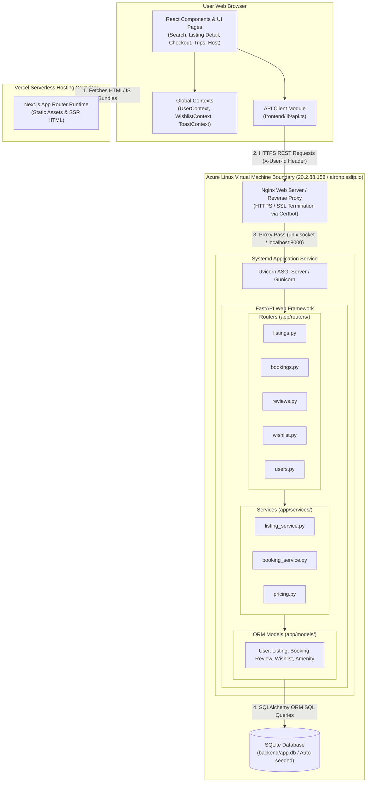
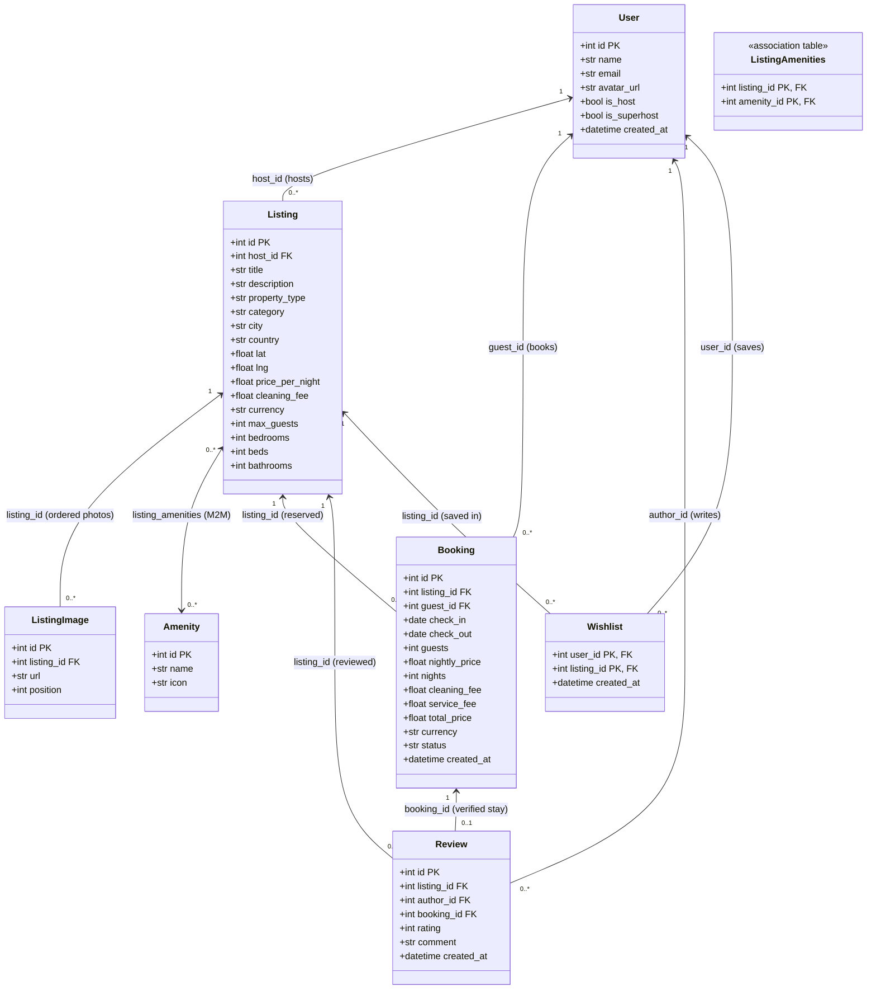
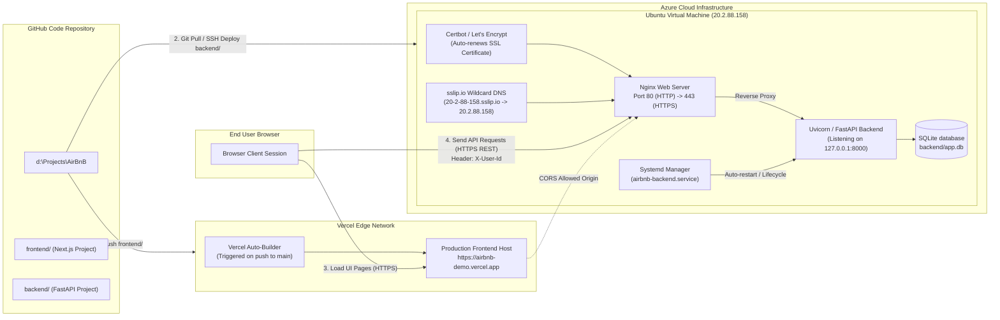

# System Diagrams

This document contains visual diagrams rendering the system architecture, database domain models, and deployment infrastructure of the application. All diagrams use native **Mermaid** syntax and reflect exact file names, model attributes, and deployment targets from the codebase.

---

## 1. System Component Diagram

### Explanation & Key Talking Points
- **What it shows**: The end-to-end multi-tier interaction flow from the user's browser, through the Next.js frontend hosted on Vercel, across the network security boundary into the Azure VM, down to the SQLite database.
- **Why it's structured this way**: The design strictly decouples client UI state from backend business logic. The API client in `frontend/lib/api.ts` acts as the single gateway for all HTTP communications, ensuring authorization headers (`X-User-Id`) and error unwrapping are handled consistently. The backend enforces a clean 3-layer architecture (Routers $\rightarrow$ Services $\rightarrow$ Models) inside an isolated Systemd/Uvicorn process managed behind Nginx.

---

## 2. Class Diagram (Backend SQLAlchemy Domain Models)

### Explanation & Key Talking Points
- **What it shows**: The relational schema design of the database models implemented in SQLAlchemy (`backend/app/models/`).
- **Why it's structured this way**: 
  - **`User` Unified Entity**: Hosting is represented as a boolean role flag (`is_host`), enabling any registered user to switch between booking properties and hosting without separate accounts.
  - **Price Snapshotting on `Booking`**: Financial attributes (`nightly_price`, `cleaning_fee`, `service_fee`, `total_price`) are stored directly on the `Booking` record to ensure immutable receipt history.
  - **Composite Keys & Integrity Constraints**: `Wishlist` uses a composite primary key `(user_id, listing_id)` preventing duplicate saves, while `Review.booking_id` has a `UNIQUE` constraint ensuring guests can only submit one verified review per stay.

---

## 3. Deployment Pipeline & Infrastructure Diagram

### Explanation & Key Talking Points
- **What it shows**: The dual-cloud deployment setup showing how the codebase is separated into two automated deployment pipelines: Next.js on Vercel and FastAPI on an Azure Linux VM.
- **Why it's structured this way**: Decoupling the frontend to Vercel provides global CDN edge delivery and instant static rendering. The Azure backend runs inside a secure Linux environment managed by Systemd to guarantee process recovery on failure. Nginx handles SSL termination via Let's Encrypt / `sslip.io` wildcard DNS, resolving mixed-content browser restrictions (`CORS_ORIGINS`) between the HTTPS Vercel domain and the Azure backend.
